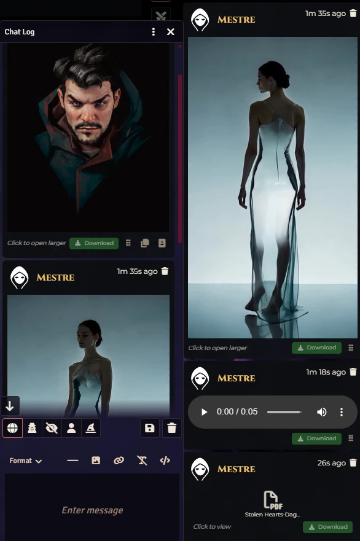
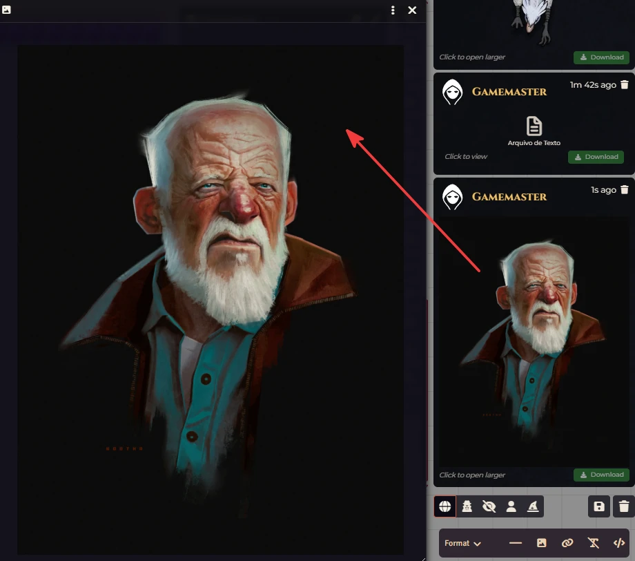
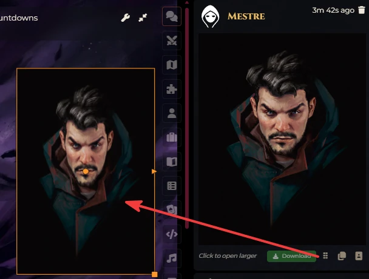
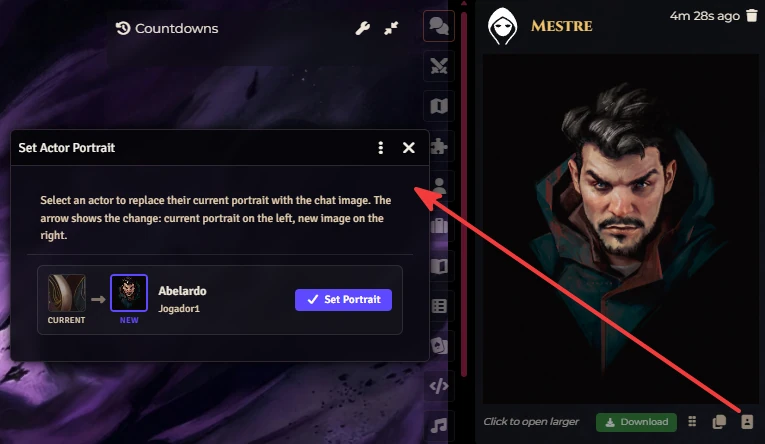
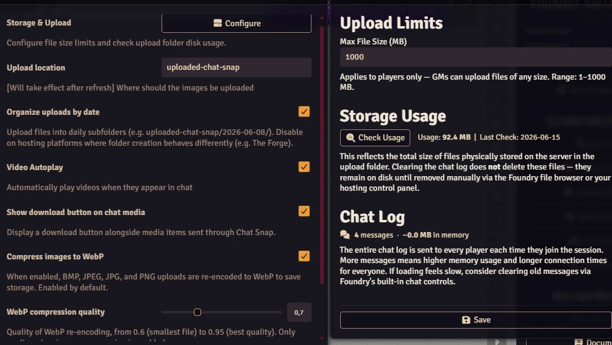

# Chat Snap

**Share images, videos, audio, PDFs, text files, 3D assets, and fonts in your Foundry VTT chat — as easily as texting a friend.**

Drop a file. Paste a link. Hit Enter. Your whole table sees it.





[](https://buymeacoffee.com/mestredigital)

---

## What It Does

Chat Snap adds image, video, audio, and file sharing directly to your game chat. No external tools, no copying links manually — just drag, drop, and post.

Whether you're a GM setting the atmosphere with a dramatic scene illustration, a player sharing a portrait of a new character, or anyone at the table sending a sound clip to complement the moment, Chat Snap keeps everyone in sync.

---

## Features

### Drag & Drop
Drag any image, video, audio, or document file from your computer straight onto the chat box. A preview appears before you send — remove it if you change your mind, add a caption, and post when ready.

### Paste to Post
Copy an image URL from the web and paste it into the chat. The module detects it automatically and queues it as a preview. Works with images copied directly from web pages too.

When you paste an external URL, Chat Snap silently fetches the file in the background and uploads it to your Foundry server — so the posted message stores a local copy instead of depending on the external host. If the remote server blocks the request (CORS), the original URL is used as a fallback with no interruption.

### Preview Before Sending
Queued media shows up as thumbnails (or a named badge for audio, PDFs, and other files) above the chat input. You can remove items before posting, or mix media with a text message — all sent together in one click.

### Click to Enlarge
Any image in chat can be clicked to open a larger view. Videos embed with full playback controls and can be double-clicked to go fullscreen. PDFs, text files, and 3D models each open their own dedicated viewer.

### Download / Open
Every media item in chat shows an action link below it. For files hosted on your Foundry server it reads **Download** — clicking saves the file to your device. For external URLs it reads **Open** and launches the link in a new browser tab so Foundry stays running. Can be disabled in module settings.

### Storage & Upload Management
A dedicated **Storage & Upload** dialog (accessible from the module settings panel) lets the GM configure the file size limit and check how much disk space the upload folder is using. A **Chat Log** section shows the current message count and estimated in-memory size of the chat log — useful for keeping session join times fast. Click **Check Usage** to scan the upload folder; the result and date are saved and shown on the next visit.

### Image Compression
BMP, JPEG, JPG, and PNG uploads are automatically re-encoded to WebP to save server storage — on by default, and toggleable in module settings. A **WebP compression quality** slider (0.6–0.95, default 0.85) tunes the balance between file size and image quality. Compression runs before the file-size check, so an oversized image that fits once re-encoded is still accepted; it's only rejected if the compressed version still exceeds the limit. If re-encoding wouldn't make a file smaller, the original is kept untouched. Animated and vector formats (GIF, APNG, SVG, WebP, AVIF) and TIFF are never altered.

### Audio Playback
Audio files embed directly in chat with native browser playback controls. Playback is client-side only — each player controls their own volume and timing independently, so pressing play only affects that client.

### PDF Sharing
Drag a PDF onto the chat input to share it. A badge (PDF icon + filename) appears in the upload strip before sending, and again in the posted message. Click the badge to open the PDF in a viewer dialog with an **Open in new tab** button as fallback. The viewer fetches the file with your session credentials, so it works reliably for both GMs and players across browsers.

### Text & Data Files
Drag a `.txt`, `.json`, `.csv`, `.md`, `.tsv`, `.xml`, `.yml`, or `.yaml` file onto the chat input to share it. A badge with a type-specific icon appears in the message. Click the badge to open a viewer dialog with the file contents — JSON is automatically pretty-printed.

### 3D Model Viewer
Drag a glTF model (`.glb` or `.gltf`) onto the chat input. A cube badge appears in the message — clicking it opens an interactive 3D viewer in a resizable popout, where you can orbit, zoom, and watch the model auto-rotate. A **Download** button is available in the viewer's toolbar.

### Fonts & Other 3D/Game Assets
Drag a font (`.otf`, `.ttf`, `.woff`, `.woff2`) or other 3D/game asset (`.fbx`, `.obj`, `.stl`, `.usdz`, `.mtl`, `.basis`, `.ktx2`) onto the chat input. A badge with a type-specific icon appears in the message. Clicking it opens the file in a new browser tab to download.

> **Note:** Only one audio, PDF, text, model, or asset file can be queued per message. These types cannot be mixed with each other or with visual media (images/videos) in the same message.

---

## GM Tools

The following features are visible and available to the GM only.

### Drag to Canvas
Images, videos, and audio files in chat messages show a **grip handle** to the right of the Download button. Drag it onto an active scene to place the asset directly on the canvas — images and videos are dropped as **Tiles**, audio files as **Ambient Sounds** at the exact drop position. The handle is hidden for external URLs and disappears when no scene is open.



### Copy Image Link
Images shared in chat (`.webp`, `.png`, `.jpg`, `.jpeg`) show a **copy icon** button next to the drag handle. Click it to copy the image URL to your clipboard instantly — handy for pasting into actor sheets, journal entries, or anywhere else in Foundry.

### Set Actor Portrait
Next to the copy button, a **portrait icon** opens a dialog listing every player's linked character (the actor assigned to a user as their Player Character). Each row shows the actor's current portrait alongside a preview of the new image, with a **Set Portrait** button to apply the change in one click. The dialog only appears for image formats (`.webp`, `.png`, `.jpg`, `.jpeg`).



---

## Supported Formats

| Type | Formats |
|------|---------|
| Images | APNG, AVIF, BMP, GIF, JPEG, JPG, PNG, SVG, TIFF, WEBP |
| Videos | MP4, WEBM, M4V, OGV |
| Audio | MP3, WAV, OGG, OPUS, FLAC, AAC, M4A, MID |
| PDF | PDF |
| Text / Data | TXT, JSON, CSV, MD, TSV, XML, YML, YAML |
| Fonts | OTF, TTF, WOFF, WOFF2 |
| 3D Models (interactive viewer) | GLB, GLTF |
| 3D / Game Assets (download only) | FBX, OBJ, STL, USDZ, MTL, BASIS, KTX2 |

---

## Settings

| Setting | Who Can Change It | What It Does |
|---|---|---|
| Upload Location | GM only | Folder where uploaded media files are stored on the server. Default: `uploaded-chat-snap`. |
| Organize uploads by date | GM only | Groups uploaded files into daily subfolders (e.g. `uploaded-chat-snap/2026-06-08/`). On by default. Disable on hosting platforms where folder creation behaves differently, such as The Forge. |
| Video Autoplay | GM only | Whether videos play automatically when they appear in chat. On by default. |
| Show download button on chat media | GM only | Displays a **Download** or **Open** link below every media item in chat. On by default. |
| Compress images to WebP | GM only | Re-encodes BMP, JPEG, JPG, and PNG uploads to WebP to save storage. On by default. |
| WebP compression quality | GM only | Quality of WebP re-encoding, from 0.6 (smallest file) to 0.95 (best quality). Default: 0.85. Only applies when image compression is enabled. |
| Setup Complete | GM only | Hides the first-run permissions dialog. Uncheck to show it again. |



### Storage & Upload Dialog

Accessible via the **Configure** button in the module settings panel.

| Option | What It Does |
|---|---|
| Max File Size (MB) | Files larger than this limit are rejected before upload for non-GM users. GMs are exempt and can upload any size. Accepts 1–1000 MB. Default: 120 MB. |
| Check Usage | Scans the upload folder and shows the total disk usage. The result and date are saved and displayed on the next visit. |
| Chat Log | Shows the current number of chat messages and their estimated in-memory size. Large chat logs slow down session joins for all players. Use Foundry's native controls to clear the log if needed. |

---

## Notes

- Works with hosting services like The Forge that use custom file management.

---

## Setup

### Installation

1. Open Foundry VTT and go to **Add-on Modules**.
2. Click **Install Module**.
3. Paste the manifest URL below and click **Install**.

```
https://raw.githubusercontent.com/brunocalado/chat-snap/main/module.json
```

4. Enable the module in your world via **Manage Modules**.

### Giving Players Permission to Post Media

By default, only the GM can upload files to the server. The first time Chat Snap loads in your world, a setup dialog will appear and offer to grant the **Upload Files** permission to players automatically.

If you skipped that step or want to change permissions later, go to:
> **Game Settings → Configure Settings → Permissions → Upload Files**

Check the roles you want to allow, then save.

---

## Bug Reports & Feature Requests

https://github.com/brunocalado/chat-snap/issues

---

## Credits and License

- Released under the [LICENSE](LICENSE).
- Forked from [Chat Media](https://github.com/p4535992/foundryvtt-chat-media) by p4535992.
